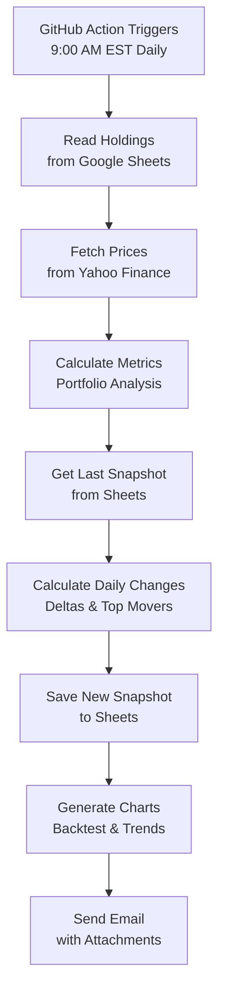

# Portfolio Tracker with Daily Historical Analysis

An automated portfolio tracking system that monitors your investments daily, tracks historical performance, and sends detailed email reports with day-over-day changes, top movers, and trend analysis.


---

## 🎯 What This Does

### Daily Automation (9:00 AM EST / 13:00 UTC)

Every day, the tracker automatically:

1. **📥 Reads Your Portfolio** from Google Sheets "Portfolio/holdings"
2. **📊 Fetches Current Prices** from Yahoo Finance for all positions
3. **💰 Calculates Metrics** including:
   - Current market value
   - Unrealized P&L ($ and %)
   - Dividend income
   - Total return (P&L + dividends)
   - Yield on cost
   - CAGR (Compound Annual Growth Rate)
   - Beta vs SPY benchmark
4. **📈 Creates Historical Snapshot** and saves to Google Sheets
5. **📉 Calculates Daily Changes** vs previous snapshot:
   - Portfolio value change
   - P&L change
   - New dividends
   - Top 3 gainers (by price %)
   - Top 3 losers (by price %)
6. **📊 Generates Charts**:
   - Buy-and-hold backtest vs SPY
   - 90-day portfolio value trend chart
7. **📧 Sends Email** with:
   - Daily changes summary
   - Top gainers and losers
   - Full portfolio dashboard
   - CSV report and charts attached
   - **Monday bonus**: Weekly summary section

---

## 📁 Project Structure

```
mkt-portfolio/
├── EigenLedger/
│   ├── main.py                    # Core portfolio analysis engine
│   ├── portfolio_tracker.py       # Main tracker entry point
│   ├── historical_tracker.py      # Daily snapshot & change tracking
│   ├── drive_client.py            # Google Drive & Sheets API integration
│   ├── email_client.py            # Gmail SMTP email sender
│   └── modules/                   # Bundled empyrical library
├── .github/workflows/
│   └── daily_run.yml              # GitHub Actions automation
├── dad_tickers.txt                # CSV fallback for local testing
├── MIGRATION_GUIDE.md             # Step-by-step setup instructions
├── SHEETS_SCHEMA.md               # Google Sheets data structure
├── CLOUD_SETUP.md                 # OAuth and cloud configuration
├── TESTING_GUIDE.md               # Testing and troubleshooting
└── README.md                      # This file
```

---

## 🚀 Quick Start

### Prerequisites

- Python 3.11+
- Poetry (package manager)
- Google account (for Sheets & Drive)
- Gmail account (for email notifications)
- GitHub account (for automation)

### 1. Clone & Install

```bash
git clone https://github.com/horchatagringo/mkt-portfolio.git
cd mkt-portfolio
poetry install
```

### 2. Set Up Google Sheet

1. Create a Google Sheet named **"Portfolio"** (case-sensitive)
2. Create a sheet tab named **"holdings"**
3. Add headers in row 1:
   ```
   Symbol | Shares | PurchaseDate
   ```
4. Add your positions (dates in mm/dd/yyyy format):
   ```
   Symbol  | Shares | PurchaseDate
   --------|--------|-------------
   NVDY    | 100    | 01/15/2024
   MSTY    | 100    | 02/20/2024
   AMZY    | 100    | 03/10/2024
   ```

### 3. Generate OAuth Credentials

```bash
poetry run python get_refresh_token.py
```

Follow the prompts to:
- Authorize Google Drive access
- Authorize Google Sheets access
- Copy the refresh token, client ID, and client secret

### 4. Configure GitHub Secrets

Go to: **Settings** → **Secrets and variables** → **Actions** → **New repository secret**

Add these 7 secrets:

| Secret Name | Description | Example |
|-------------|-------------|---------|
| `GOOGLE_CLIENT_ID` | OAuth Client ID | `123.apps.googleusercontent.com` |
| `GOOGLE_CLIENT_SECRET` | OAuth Client Secret | `GOCSPX-abc123` |
| `GOOGLE_REFRESH_TOKEN` | OAuth Refresh Token | `1//xyz789` |
| `DRIVE_FOLDER_ID` | Drive folder ID (optional) | `1a2b3c4d5e6f` |
| `EMAIL_USER` | Gmail address | `you@gmail.com` |
| `EMAIL_PASSWORD` | Gmail App Password | `abcd efgh ijkl mnop` |
| `EMAIL_TO` | Recipients (comma-separated) | `recipient@email.com` |

### 5. Test the Workflow

Go to: **Actions** → **Daily Portfolio Update** → **Run workflow**

Check your email for the daily report!

---

## 📊 Google Sheets Data Structure

Your **"Portfolio"** spreadsheet will have 3 sheets:

### Sheet 1: `holdings` (You Edit)
Your current positions - **you manually update this**

| Symbol | Shares | PurchaseDate |
|--------|--------|--------------|
| NVDY   | 100    | 01/15/2024   |
| MSTY   | 100    | 02/20/2024   |

### Sheet 2: `snapshots` (Auto-Generated)
Daily portfolio snapshots - **tracker appends daily**

| timestamp | date | total_value | total_cost | unrealized_pl | ... | snapshot_json |
|-----------|------|-------------|------------|---------------|-----|---------------|
| 2025-01-15T13:00:00Z | 2025-01-15 | 125430.50 | 98500.00 | 26930.50 | ... | `{...}` |

### Sheet 3: `daily_changes` (Auto-Generated)
Day-over-day deltas - **tracker appends daily**

| date | prev_date | value_change | value_change_pct | top_gainers | top_losers |
|------|-----------|--------------|------------------|-------------|------------|
| 2025-01-15 | 2025-01-14 | 1250.75 | 1.01 | `[...]` | `[...]` |

For detailed schema, see [SHEETS_SCHEMA.md](SHEETS_SCHEMA.md).

---

## 📧 Email Report Format

### Daily Email (Tuesday - Sunday)

```
Daily Portfolio Update - Wednesday, January 15, 2025
================================================================================

📊 DAILY CHANGES (vs 2025-01-14)
================================================================================
Portfolio Value Change: $1,250.75 (+1.01%)
P&L Change:            $1,150.50
New Dividends:         $100.25
Total Return Change:   $1,250.75

🔥 Top Gainers:
  1. NVDY: +5.20%
  2. MSTY: +3.10%
  3. AMZY: +2.80%

📉 Top Losers:
  1. SLTY: -2.10%
  2. CONY: -1.50%
  3. ULTY: -0.80%

📈 PORTFOLIO SUMMARY
================================================================================
Total Invested:   $98,500.00
Current Value:    $125,430.50
Unrealized P&L:   $26,930.50 (27.34%)
Dividend Income:  $3,420.00
Total Return:     $30,350.50 (30.81%)

📊 PORTFOLIO DASHBOARD
================================================================================
[Full position-by-position breakdown]

Attachments:
  - portfolio_report.csv (detailed metrics)
  - portfolio_backtest.png (performance vs SPY)
  - portfolio_trends.png (90-day trend chart)
```

### Monday Email (Includes Weekly Summary)

Same as above, plus:

```
📅 WEEKLY SUMMARY
================================================================================
Check the attached trend chart for 90-day performance history.
Review your position allocations and rebalance if needed.
```

---

## ⚙️ Configuration

### Environment Variables

| Variable | Default | Description |
|----------|---------|-------------|
| `ENABLE_CLOUD` | `false` | Enable Google Sheets & email integration |
| `USE_SHEETS` | `false` | Read holdings from Sheets (vs CSV file) |
| `GOOGLE_CLIENT_ID` | - | OAuth Client ID |
| `GOOGLE_CLIENT_SECRET` | - | OAuth Client Secret |
| `GOOGLE_REFRESH_TOKEN` | - | OAuth Refresh Token |
| `DRIVE_FOLDER_ID` | - | (Optional) Drive folder for file uploads |
| `EMAIL_USER` | - | Gmail address |
| `EMAIL_PASSWORD` | - | Gmail App Password |
| `EMAIL_TO` | `EMAIL_USER` | Recipient email(s) - comma-separated |

### Local Testing (Without Sheets)

```bash
# Uses dad_tickers.txt instead of Google Sheets
export USE_SHEETS=false
poetry run portfolio-tracker
```

### Local Testing (With Sheets)

```bash
# Requires credentials.json in project root
export ENABLE_CLOUD=true
export USE_SHEETS=true
poetry run portfolio-tracker
```

---

## 📈 How It Works

### Data Flow



### First Run vs Ongoing Runs

**First Run (Day 1)**:
- ✅ Creates first snapshot
- ✅ Auto-creates "snapshots" and "daily_changes" sheets
- ✅ Email says "Historical tracking started"
- ❌ No daily changes (need 2+ snapshots to compare)

**Second Run (Day 2+)**:
- ✅ Creates new snapshot
- ✅ Calculates daily changes
- ✅ Email shows value change, top movers, etc.
- ✅ Trend chart shows multiple data points

---

## 📊 Metrics Calculated

### Portfolio-Level Metrics

- **Total Invested**: Sum of all cost bases
- **Current Value**: Sum of all market values
- **Unrealized P&L**: Current value - Total invested
- **Dividend Income**: Total dividends received since purchase
- **Total Return**: Unrealized P&L + Dividend income
- **Position Count**: Number of holdings

### Position-Level Metrics

For each stock:

| Metric | Description |
|--------|-------------|
| **Purchase Price** | Adjusted close on purchase date |
| **Current Price** | Latest adjusted close |
| **Cost Basis** | Shares × Purchase price |
| **Market Value** | Shares × Current price |
| **Unrealized P&L** | Market value - Cost basis |
| **Dividend Income** | Total dividends received (post-purchase) |
| **Total Return** | Unrealized P&L + Dividends |
| **Yield on Cost** | Annual dividend / Purchase price |
| **CAGR** | Compound annual growth rate |
| **Beta** | Volatility vs SPY (since purchase) |

### Daily Change Metrics

- **Value Change**: Today's value - Yesterday's value
- **Value Change %**: (Value change / Yesterday's value) × 100
- **P&L Change**: Today's P&L - Yesterday's P&L
- **Dividend Change**: New dividends received since yesterday
- **Top Gainers**: Top 3 positions by price % change
- **Top Losers**: Bottom 3 positions by price % change

---

## 🛠️ Maintenance

### Updating Your Portfolio

**Add a Position**:
1. Open Google Sheets "Portfolio/holdings"
2. Insert new row with Symbol, Shares, PurchaseDate
3. Next daily run will include it

**Remove a Position**:
1. Delete the entire row from holdings sheet
2. Daily changes will show it as "SOLD"

**Update Shares** (e.g., after buying more):
1. Edit the Shares column
2. Daily changes will detect quantity change

### Viewing Historical Data

**In Google Sheets**:
- Chart portfolio value over time using snapshots sheet
- Filter daily_changes by date range
- Export to CSV for external analysis

**90-Day Trend Chart**:
- Attached to every email
- Shows portfolio value vs cost basis

### Backing Up Data

**Option 1: Google Sheets Version History**
- File → Version history → See version history

**Option 2: Google Takeout**
- Export all Sheets data periodically

**Option 3: Local CSV Export**
- Email attachments contain daily CSV snapshots

---

## 🔍 Troubleshooting

### Common Issues

**Email not received**:
- Check spam folder
- Verify EMAIL_USER and EMAIL_PASSWORD secrets
- Use Gmail App Password, not regular password

**"Spreadsheet 'Portfolio' not found"**:
- Spreadsheet name is case-sensitive
- Must be exactly "Portfolio"

**"No data found in 'holdings' sheet"**:
- Check sheet name is exactly "holdings"
- Verify column headers: Symbol, Shares, PurchaseDate
- Ensure at least one data row exists

**"Invalid purchase price ($0.0)"**:
- Ticker may be invalid or delisted
- Purchase date may be before IPO
- Check ticker symbol spelling

**GitHub Action fails**:
- Check Actions logs for specific error
- Verify all 7 secrets are configured
- Ensure GOOGLE_REFRESH_TOKEN is regenerated with Sheets scope

For detailed troubleshooting, see [TESTING_GUIDE.md](TESTING_GUIDE.md).

---

## 📚 Documentation

| Document | Purpose |
|----------|---------|
| [README.md](README.md) | This file - overview and daily workflow |
| [MIGRATION_GUIDE.md](MIGRATION_GUIDE.md) | Step-by-step setup instructions |
| [SHEETS_SCHEMA.md](SHEETS_SCHEMA.md) | Detailed Google Sheets data structure |
| [CLOUD_SETUP.md](CLOUD_SETUP.md) | OAuth credentials and Google Cloud setup |
| [TESTING_GUIDE.md](TESTING_GUIDE.md) | Testing procedures and troubleshooting |
| [QUICK_START.md](QUICK_START.md) | Abbreviated setup guide |

---

## 🔐 Security & Privacy

### Credentials Storage

- **GitHub Secrets**: Encrypted at rest, only accessible to workflows
- **OAuth Tokens**: Refresh tokens stored in secrets, auto-refresh access tokens
- **Passwords**: Gmail App Passwords (not your main password)

### Data Privacy

- **Portfolio data**: Stored in YOUR Google Sheets (you control sharing)
- **Email reports**: Sent only to addresses you specify
- **No third-party sharing**: Data stays between Google, GitHub, and your email

### Best Practices

- ✅ Use Gmail App Passwords (enable 2FA first)
- ✅ Keep spreadsheet private (no public sharing)
- ✅ Rotate OAuth tokens if compromised
- ✅ Review GitHub Actions logs periodically
- ❌ Don't commit credentials.json or token.json to git

---

## 🤝 Contributing

Contributions welcome! Please:

1. Fork the repository
2. Create a feature branch
3. Make your changes
4. Test thoroughly
5. Submit a pull request

---

## 📜 License

Apache License 2.0

Original EigenLedger library by [Santosh Passoubady](https://github.com/ssantoshp/EigenLedger)

---

## 🙏 Credits

Built on top of:
- **[EigenLedger](https://github.com/ssantoshp/EigenLedger)** - Portfolio analysis framework
- **[QuantStats](https://github.com/ranaroussi/quantstats)** - Financial metrics
- **[PyPortfolioOpt](https://github.com/robertmartin8/PyPortfolioOpt)** - Portfolio optimization
- **[yfinance](https://github.com/ranaroussi/yfinance)** - Market data

---

## 📞 Support

- **Issues**: [GitHub Issues](https://github.com/horchatagringo/mkt-portfolio/issues)
- **Documentation**: See [docs section](#-documentation) above
- **Email**: Check troubleshooting guides first

---

## 🎯 Features Roadmap

- [x] Daily historical snapshots
- [x] Day-over-day change tracking
- [x] Top gainers/losers identification
- [x] 90-day trend charts
- [x] Weekly summary emails
- [ ] Interactive Sheets dashboard
- [ ] SMS notifications for large moves
- [ ] Multi-portfolio support
- [ ] Tax loss harvesting alerts
- [ ] Rebalancing recommendations

---

## 📊 Example Output

### Email Dashboard
```
Ticker  Qty  Purch Date  Purch Price  Curr Price  Cost Basis  Mkt Value   P&L %    Div Income  Total Ret (%)  CAGR      Beta
------  ---  ----------  -----------  ----------  ----------  ---------  -------  ----------  -------------  -------  ------
NVDY    100  2024-01-15        25.50       32.75     2550.00    3275.00  28.43%       150.00         34.31%   28.50%    1.15
MSTY    100  2024-02-20        18.25       22.10     1825.00    2210.00  21.10%        85.00         25.75%   22.40%    1.08
AMZY    100  2024-03-10        30.00       28.50     3000.00    2850.00  -5.00%       120.00         -1.00%   -1.25%    0.95
```

### Trend Chart


---

**Built with ❤️ for passive income portfolio tracking**

**Last Updated**: January 2025
